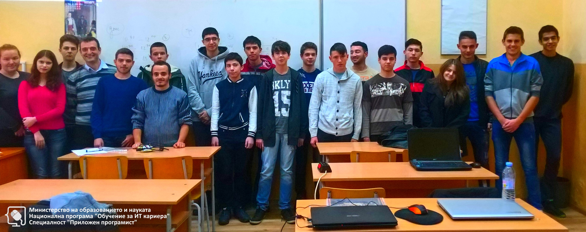

# Обучителен модул "Увод в програмирането"
- Национална програма "Обучение за ИТ кариера"
- Професия "Приложен програмист" 
- Образователен център: Професионална имназия по електротехника и електроника "Константин Фотинов", гр.Бургас  
- Електронен портал: https://it-kariera.mon.bg/e-learning/

## Преподавател
- доц. д-р Димитър Минчев
- e-mail: dimitar.minchev@gmail.com 
- blog: http://www.minchev.eu

## Учебна програма
- Първи стъпки в програмирането
- Пресмятания, оператори, изрази 
- Проверки (условни конструкции) 
- Повторения (цикли) 
- Подпрограми (функции и методи) 
- Практически изпит

## Обучаеми 2018

## Обучаеми 2019
