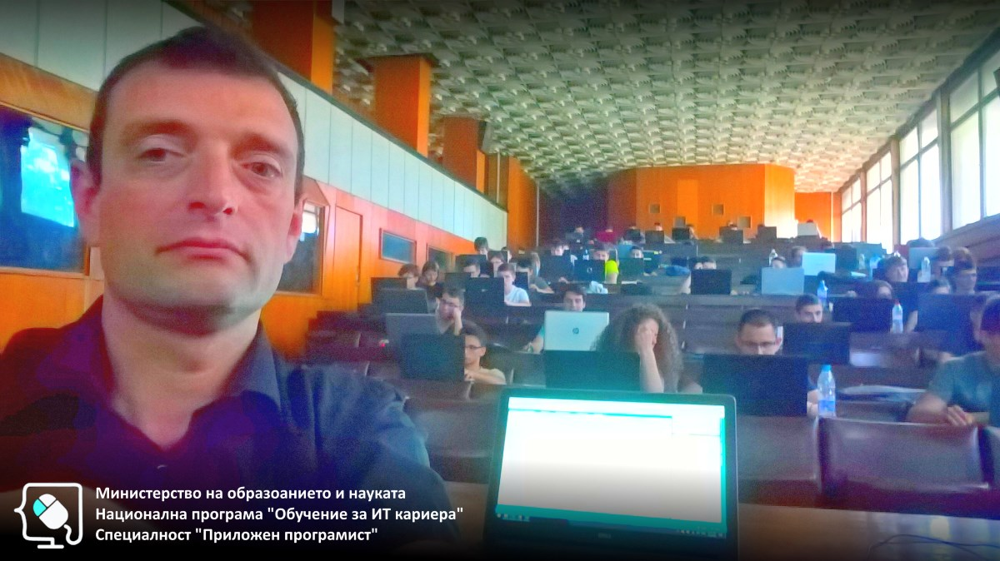

# Обучителен модул "Увод в Алгоритмите и структурите от данни"
- Национална програма "Обучение за ИТ кариера"
- Професия "Приложен програмист" 
- Образователен център: Професионална имназия по електротехника и електроника "Константин Фотинов", гр.Бургас  
- Електронен портал: https://it-kariera.mon.bg/e-learning/

## Преподавател
- доц. д-р Димитър Минчев
- e-mail: dimitar.minchev@gmail.com 
- blog: http://www.minchev.eu

## Учебна програма
- Въведение в алгоритмите
- Линейни структури от данни
- Алгоритми върху линейни структури
- Алгоритми за сортиране
- Алгоритми за търсене
- Подготовка за практически изпит 

## Обучаеми 2018

## Обучаеми 2019

## Видео уроци
1. [Откриване на курса](https://youtu.be/jUJKyj9F5E0)
2. [Сложност на алгоритъм](https://youtu.be/vszr-JNzfDw)
3. [Асимптотични нотации](https://youtu.be/4Zq8RcbHn4s)
4. [Разтеглив Масив](https://youtu.be/E1sWABbcIJM)
5. [Свързан Списък](https://youtu.be/jicbGS9Tf9A)
6. [Опашка](https://youtu.be/AG64UGEhxqQ)
7. [Стек](https://youtu.be/GR_1ZpbvzhU)
8. [Линейни Структури от Данни - упражнения](https://youtu.be/ZWvCZt8bp1o)
9. [Линейни Структури от Данни - упражнения](https://youtu.be/yNXJh4L8fkY)
10. [Алгоритми върху линейни структури от данни. Стек и опашка](https://youtu.be/c0-joWo_b50)
11. [Алгоритми върху линейни структури от данни. Обединение, сечение](https://youtu.be/QISZJHLkOVY)
12. [Алгоритми върху линейни структури от данни. Подредици](https://youtu.be/Bs6r0fxhyZY)
13. [Алгоритми върху линейни структури от данни. Рекурсия](https://youtu.be/JBqWXcNeoGQ)
14. [Алгоритми за сортиране](https://youtu.be/ejurFxkdc1Q)
15. [Алгоритми за сортиране](https://youtu.be/mRXHIb_tiCs)
16. [Алгоритми за сортиране](https://youtu.be/ZMhpnm-YGag)
17. [Алгоритми за сортиране](https://youtu.be/KiDfLKus3N8)
18. [Алгоритми за сортиране](https://youtu.be/-3-T7_3_mUU)
19. [Алгоритми за сортиране](https://youtu.be/K8HTzqe1cgo)
20. [Алгоритми за Търсене](https://youtu.be/slwMrS8KWwE)
21. [Алгоритми за Търсене](https://youtu.be/0VjadjXyyEM)
22. [Подготовка за изпит](https://youtu.be/of7IN_CEVfE)
