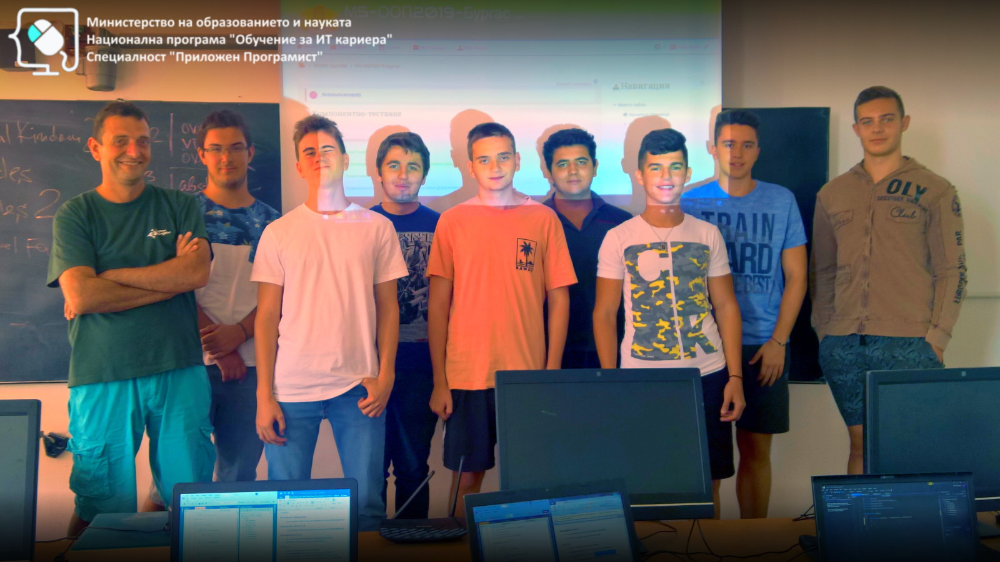
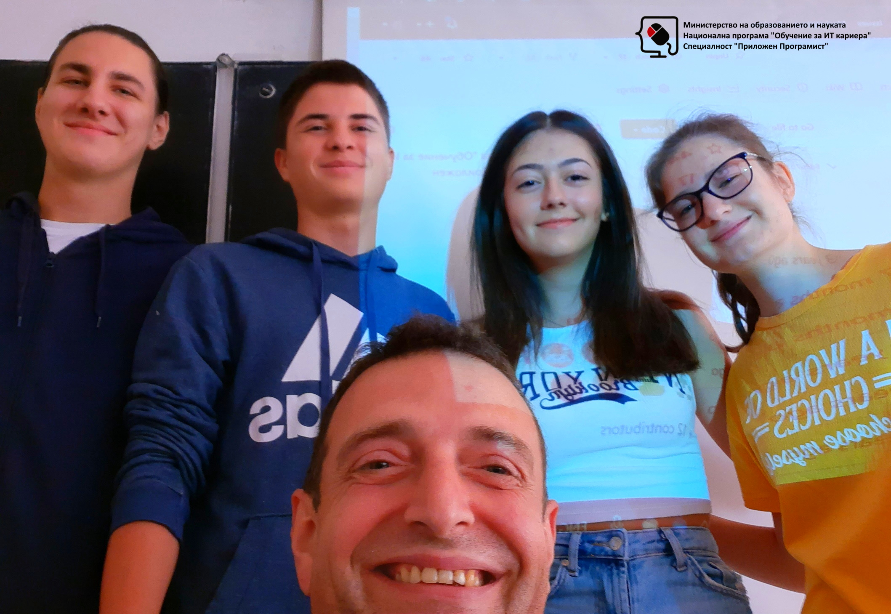

# Обучителен модул "Обектно-ориентирано програмиране"
- Национална програма "Обучение за ИТ кариера"
- Професия "Приложен програмист" 
- Образователен център: Професионална имназия по електротехника и електроника "Константин Фотинов", гр.Бургас  
- Електронен портал: https://it-kariera.mon.bg/e-learning/

## Преподавател
- доц. д-р Димитър Минчев
- e-mail: dimitar.minchev@gmail.com 
- blog: http://www.minchev.eu

## Учебна програма
- Компонентно тестване
- Дефиниране на класове за напреднали
- Шаблонни класове
- Наследяване, абстракция, интерфейси	
- Полиморфизъм в ООП
- Работа с обекти
- Елементи от функционалното програмиране
- Комуникация между обекти (събития / интерфейси)
- Изключения (exceptions)	
- Работа с потоци и файлове
- Базови шаблони за дизайн (design patterns)	
- Подготовка за практически изпит 

## Обучаеми 2018

## Обучаеми 2019

## Обучаеми 2022

## Видео уроци
1. [Откриване на курса](https://youtu.be/Vd5nml7ZthQ)
2. Компонентно тестване: [Част 1](https://youtu.be/DxHbpT6u0V4) и [Част 2](https://youtu.be/5CwkbtVGlEI)
3. Дефиниране на класове за напреднали: [Част 1](https://youtu.be/pTymyS0ry8E), [Част 2](https://youtu.be/WvHgA7YvK34) и  [Част 3](https://youtu.be/QfWWXrTLAgA)
4. [Шаблонни класове](https://youtu.be/TF1thhcmeRc)
5. Наследяване, абстракция, интерфейси: [Част 1](https://youtu.be/Mwozr44S43w), [Част 2](https://youtu.be/6Um13mqyUEQ) и [Част 3](https://youtu.be/A2I-0q-adt0)
6. Полиморфизъм в ООП: [Част 1](https://youtu.be/ZiBjC6WRygM), [Част 2](https://youtu.be/KOnDDqf9pQY) и и [Част 3](https://youtu.be/FLlad2DyPB4)
7. [Работа с обекти](https://youtu.be/ZiBjC6WRygM)
8. [Елементи от функционалното програмиране](https://youtu.be/N20Y5xgO0sM)
9. [Изключения](https://youtu.be/b8Z-Rg-tyVU)
10. [Комуникация между обекти, събития и интерфейси](https://youtu.be/O_aBn8v0fkk)
11. [Работа с потоци и файлове](https://youtu.be/sdSN14iNT4I)
12. [Базови шаблони за дизайн](https://youtu.be/A53ZLdKAtAo)

