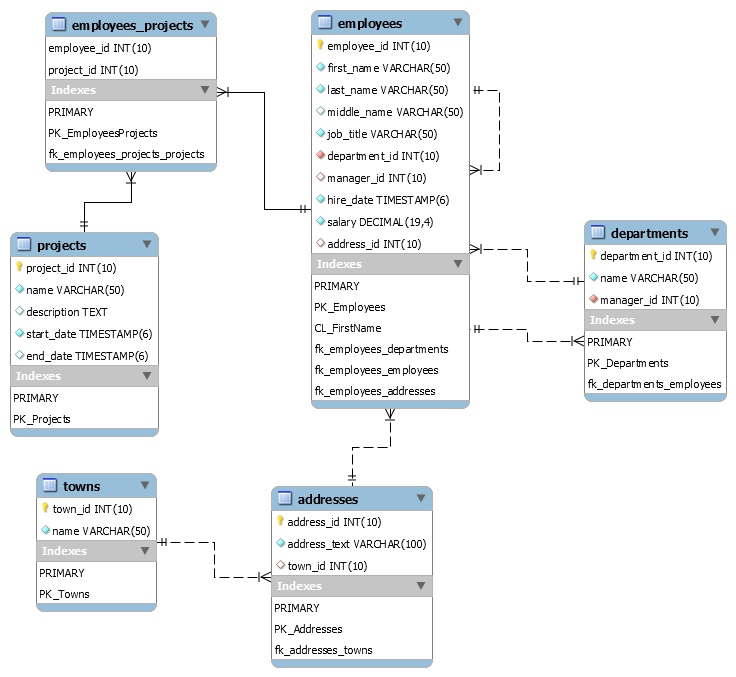

# 2. Взаимовръзки

## Връзка: едно към много
```
CREATE TABLE country (
  id INT PRIMARY KEY,
  name TEXT
);
CREATE TABLE city (
  id INT PRIMARY KEY,
  name TEXT,
  country_id INT,
  CONSTRAINT fk_country FOREIGN KEY (id) REFERENCES country(id)
);
```
## Връзка: Много към много
```
CREATE TABLE employees (
  employee_id INT PRIMARY KEY,
  employee_name VARCHAR(50)
);
CREATE TABLE projects (
  project_id INT PRIMARY KEY,
  project_name VARCHAR(50)
);
CREATE TABLE employees_projects (
  employee_id INT,
  project_id INT,
  CONSTRAINT pk_employees_projects PRIMARY KEY(employee_id, project_id),
  CONSTRAINT fk_employees_projects_employees FOREIGN KEY(employee_id) REFERENCES employees(employee_id),
  CONSTRAINT fk_employees_projects_projects FOREIGN KEY(project_id) REFERENCES projects(project_id)
);
```
## Връзка: едно към едно
```
CREATE TABLE drivers (
  driver_id INT PRIMARY KEY,
  driver_name VARCHAR(50)
);
CREATE TABLE cars (
  car_id INT PRIMARY KEY,
  driver_id INT UNIQUE,
  CONSTRAINT fk_cars_drivers FOREIGN KEY (driver_id) REFERENCES drivers(driver_id)
);
```

## Релационни схеми (Entity/Relationship)

### soft_uni 


### geography 


### diablo 
