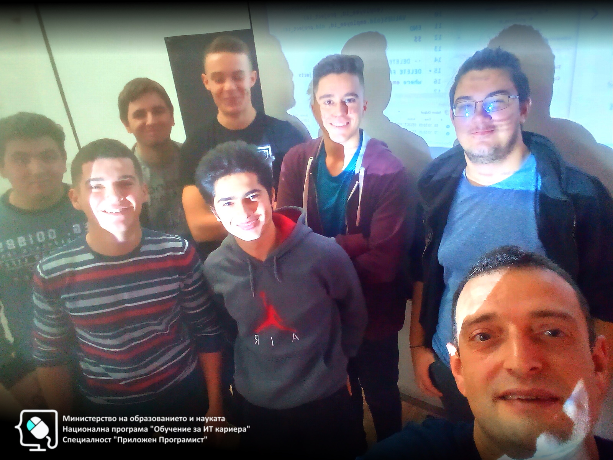
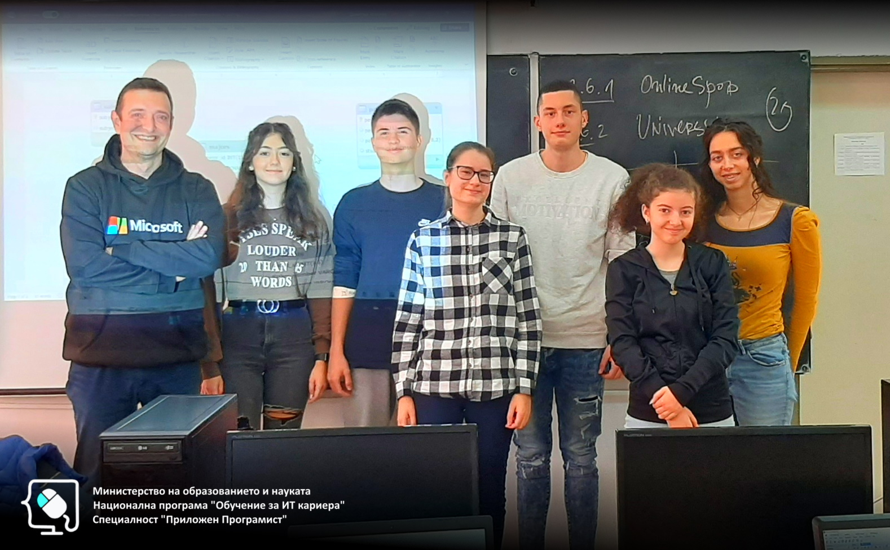

# Обучителен модул "База данни"
- Национална програма "Обучение за ИТ кариера"
- Професия "Приложен програмист" 
- Образователен център: Професионална имназия по електротехника и електроника "Константин Фотинов", гр.Бургас  
- Електронен портал: https://it-kariera.mon.bg/e-learning/

## Преподавател
- доц. д-р Димитър Минчев
- e-mail: dimitar.minchev@gmail.com 
- blog: http://www.minchev.eu

## Учебна програма
- Въведение в базите данни
- Моделиране на релационни бази от данни	
- Заявки за извличане и промяна на данни	
- Сложни заявки за извличане на данни 
- Съединения на таблици 
- Агрегация и групиране на данни
- Скаларни функции, работа с дати, транзакции
- Подготовка за практически изпит 

## Обучаеми 2018

## Обучаеми 2019

## Обучаеми 2022
