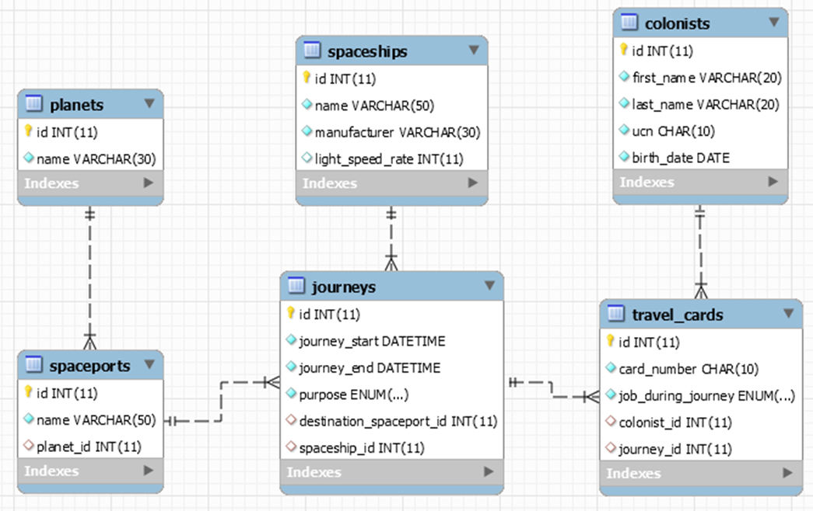

### Colonial Journey Management System
Базата данни **colonial_journey_management_system** има следната E/R диаграма:
 

#### Part I. Data Definition Language (DDL)

**planets**

| Column Name | Data Type                         | Constraints                 |
|-------------|-----------------------------------|-----------------------------|
| id          | Integer, от 1 до 2,147,483,647.   | Primary Key: AUTO_INCREMENT |
| name        | Низ съдържащ максимум 30 символа. | NULL НЕ е разрешено.        |

**spaceports**

| Column Name | Data Type                         | Constraints                 |
|-------------|-----------------------------------|-----------------------------|
| id          | Integer, from 1 to 2,147,483,647. | Primary Key: AUTO_INCREMENT |
| name        | Низ съдържащ максимум 50 символа. | NULL НЕ е разрешено.        |
| planet_id   | Integer, от 1 до 2,147,483,647.   | Връзка с таблицата planets. |.

**spaceships**

| Column Name      | Data Type                         | Constraints                     |
|------------------|-----------------------------------|---------------------------------|
| id               | Integer, от 1 до 2,147,483,647.   | Primary Key: AUTO_INCREMENT     |
| name             | Низ съдържащ максимум 50 символа. | NULL НЕ е разрешено.            |
| manufacturer     | Низ съдържащ максимум 30 символа. | NULL НЕ е разрешено.            |
| light_speed_rate | Integer, от 0 до 2,147,483,647.   | Има стойност по подразбиране 0. |

**colonists**

| Column Name | Data Type                         | Constraints                              |
|-------------|-----------------------------------|------------------------------------------|
| id          | Integer, от 1 до 2,147,483,647.   | Primary Key: AUTO_INCREMENT              |
| first_name  | Низ съдържащ максимум 20 символа. | NULL НЕ е разрешено.                     |
| last_name   | Низ съдържащ максимум 30 символа. | NULL НЕ е разрешено.                     |
| ucn         | Низ съдържащ точно 10 символа.    | NULL НЕ е разрешено. УНИКАЛНИ стойности. |
| birth_date  | Дата без време.                   | NULL НЕ е разрешено.                     |

**journeys**

| Column Name              | Data Type                         | Constraints                                                                               |
|--------------------------|-----------------------------------|-------------------------------------------------------------------------------------------|
| id                       | Integer, от 1 до 2,147,483,647.   | Primary Key: AUTO_INCREMENT                                                               |
| journey_start            | Дата с време.                     | NULL НЕ е разрешено.                                                                      |
| journey_end              | Дата с време.                     | NULL НЕ е разрешено.                                                                      |
| purpose                  | Низ съдържащ максимум 11 символа. | Трябва да е една от следните стойности: “Medical”, “Technical”, “Educational”, “Military” |
| destination_spaceport_id | Integer, от 1 до 2,147,483,647.   | Връзка с таблицата spaceports.                                                            |
| spaceship_id             | Integer, от 1 до 2,147,483,647.   | Връзка с таблицата spaceships.                                                            |

**travel_cards**

| Column Name        | Data Type                         | Constraints                                                                                      |
|--------------------|-----------------------------------|--------------------------------------------------------------------------------------------------|
| id                 | Integer, from 1 to 2,147,483,647. | Primary Key: AUTO_INCREMENT                                                                      |
| card_number        | Низ съдържащ точно 10 символа.    | NULL НЕ е разрешено. УНИКАЛНИ стойности.                                                         |
| job_during_journey | Низ съдържащ максимум 6 символа.  | Should only contain one of the following jobs: “Pilot”, “Engineer”, “Trooper”, “Cleaner”, “Cook” |
| colonist_id        | Integer, от 1 до 2,147,483,647.   | Връзка с таблицата colonists.                                                                    |
| journey_id         | Integer, от 1 до 2,147,483,647.   | Връзка с таблицата journeys.                                                                     |

#### Part II. Queries 
Изпратете всички SQL заявки за създаване на таблици.
Вие също ще получите data.sql файл. Той ще съдържа набор от данни с произволни данни, които ще трябва да съхранявате в локалната си база данни. Тези данни ще ви бъдат дадени, така че няма да ви се налага да мислите за данните и да загубите съществено време в процеса.

##### Query 2. Вмъкване на данни
You will have to INSERT records of data into the travel_cards table, based on the colonists table.
За колонисти с id между 96 и 100 (включително) въведете данни в таблицата travel_cards със следните стойности:
- За колонистите родени след ‘1980-01-01’, номерът на картата трябва да бъде комбинация между годината на раждане, деня и първите 4 цифри от UCN. - За останалата част - година на раждане, месец и последните 4 цифри от UCN.
- За колонистите с id което може да бъде разделено на 2 без остатък, работата трябва да бъде ‘Pilot’, за колонистите с id което може да бъде разделено на 3 без остатък – ‘Cook’, за всички останали – ‘Engineer’.
- Id на пътуването е първата цифра от полета на колониста.

##### Query 3. Обновяване на данни
ОБНОВЕТЕ целта на пътуването, на тези пътувания които отговарят на следните условия:
- Ако id-то на пътуването е делим на 2 без остатък **Medical**.
- Ако id-то на пътуването е делим на 3 без остатък **Technical**.
- Ако id-то на пътуването е делим на 5 без остатък **Educational**.
- Ако id-то на пътуването е делим на 7 без остатък **Military**.

##### Query 4. Изтриване на данни
Изтрийте от колонистите тези, които нямат пътуване.

##### Query 5. Извлечете всички карти за пътуване
Извлечете от базата данни всички карти за пътуване. Сортирайте резултатите по номер на картата във възходящ ред.

| card_number | job_during_journey |
|-------------|--------------------|
| 32031181    | Engineer           |
| 37637193    | Engineer           |
| ...         | ...                |

##### Query 6. Извлечете всички колонисти
Изведете от базата данни, всички колонисти. Сортирайте резултатите по собствено име, по фамилно име и най-накрая по id по възходящ ред.

| id  | full_name          | ucn        |
|-----|--------------------|------------|
| 35  | Aigneis McConville | 9225403496 |
| 92  | Althea Kelinge     | 9998159318 |
| ... | ...                | ...        |

##### Query 7. Извлечете всички военни пътувания
Извлечение от базата данни, всички военни пътувания. Сортирайте резултатите по начална дата на пътуването във възходящ ред.

| id  | journey_start   | journey_end    |
|-----|-----------------|----------------|
| 7   | 1/4/2019 23:44  | 12/9/2049 4:00 |
| 3   | 2/21/2019 22:06 | 1/3/2049 11:00 |
| ... | ...             | ...            |

##### Query 8. Извлечете всички пилоти
Извлечете от базата данни всички колонисти, които имат пилотна работа. Сортирайте резултата по id във възходящ ред.

| id  | full_name   |
|-----|-------------|
| 6   | Clark Cowan |
| 18  | Wald Bim    |
| ... | ...         |

##### Query 9. Изтеглете най-бързия космически кораб
Извлечете от базата данни най-бързия космически кораб (**fastest spaceship**) и името на неговия целеви космодрум (**destination spaceport name**). С други думи, корабът с най-висока скорост на светлината (**highest light speed rate**).

| spaceship_name | spaceport_name    |
|----------------|-------------------|
| SSE Priestess  | Yggdrasil Station |

##### Query 10. Извлечете всички образователни мисии и космически кораби
Извличане от базите данни на всички планети и техните космодруми, които имат образователни мисии. Сортирайте резултатите по име на космодрума в низходящ ред.

| planet_name | spaceport_name    |
|-------------|-------------------|
| Kascarth    | Yggdrasil Station |
| Lescore     | Tartarus          |
| ...         | ...               |

##### Query 11. Извлечете всички планети и тяхното пътуване
Извлечете от базата данни всички имена на планетите и пътуванията им. Поръчайте резултатите по броя на пътуванията, низходящите и възходящите по име на планетата.

| planet_name    | journeys_count |
|----------------|----------------|
| Otroyphus      | 4              |
| Eipra          | 2              |
| ...            | ...            |
