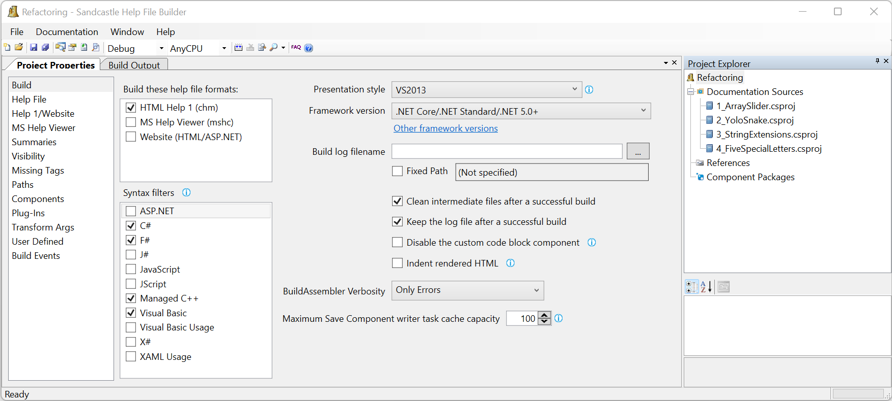

# XML Documentation

## Step 1. Download and Install

1. [Microsoft HTML Help Workshop 1.3](https://www.helpandmanual.com/download/htmlhelp.exe)

2. [Sandcastle Help File Builder](https://github.com/EWSoftware/SHFB/releases/)

##  Step 2. Resources

1. [GitHub Repository](https://github.com/EWSoftware/SHFB)

2. [Getting Started](http://ewsoftware.github.io/SHFB/html/b772e00e-1705-4062-adb6-774826ce6700.htm)

## Step 3. Create Manual

