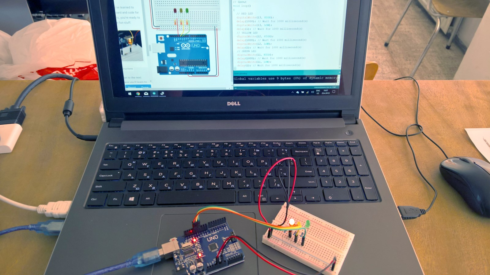

# Arduino Uno


# Arduino Uno Pinout


# Autodesk IDE
https://www.tinkercad.com/

# Arduino IDE
https://www.arduino.cc/

# Projects
## 1. Trafic Lights

```
void setup()
{
  pinMode(11, OUTPUT);
  pinMode(12, OUTPUT);
  pinMode(13, OUTPUT);
}
void loop()
{
  digitalWrite(13, HIGH);
  delay(1000); 
  digitalWrite(13, LOW);

  digitalWrite(12, HIGH);
  delay(1000); 
  digitalWrite(12, LOW);

  digitalWrite(11, HIGH);
  delay(1000); 
  digitalWrite(11, LOW);
}
```
## 2. Disco

```
void setup() 
{
  pinMode(4, OUTPUT);
  pinMode(5, OUTPUT);
  pinMode(6, OUTPUT);
  pinMode(7, OUTPUT);
  pinMode(8, OUTPUT);
  pinMode(9, OUTPUT);
  pinMode(10, OUTPUT);
  pinMode(11, OUTPUT);
  pinMode(12, OUTPUT);
  pinMode(13, OUTPUT);
}
void loop()
{
  int rand = random(4, 13);
  digitalWrite(rand, HIGH);
  delay(10);
  digitalWrite(rand, LOW);
}
```
## 3. Photo Resistor

```
void setup()
{
  pinMode(A0, INPUT);
  pinMode(13, OUTPUT);
}

void loop()
{
  // Light Sensor
  if (analogRead(A0) < 100) {
    digitalWrite(13, HIGH);
  } else {
    digitalWrite(13, LOW);
  }
  delay(10); 
}
```
## 4. Buttons

```
int ButtonRedState = 0;
int ButtonYellowState = 0;
int ButtonGreenState = 0;

void setup()
{
  pinMode(3, INPUT);
  pinMode(13, OUTPUT);
  pinMode(2, INPUT);
  pinMode(12, OUTPUT);
  pinMode(1, INPUT);
  pinMode(11, OUTPUT);
}

void loop()
{
  // Red Button
  ButtonRedState = digitalRead(3);
  if (ButtonRedState == HIGH) {
    digitalWrite(13, HIGH);
  } else {
    digitalWrite(13, LOW);
  }
  // Yellow Button
  ButtonYellowState = digitalRead(2);
  if (ButtonYellowState == HIGH) {
    digitalWrite(12, HIGH);
  } else {
    digitalWrite(12, LOW);
  }
  // Green Button
  ButtonGreenState = digitalRead(1);
  if (ButtonGreenState == HIGH) {
    digitalWrite(11, HIGH);
  } else {
    digitalWrite(11, LOW);
  }
  ButtonRedState;
  delay(10); 
}
```
