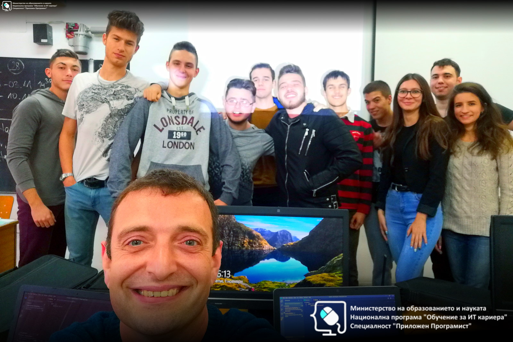

# Обучителен модул "Функционално програмиране"
- Национална програма "Обучение за ИТ кариера"
- Професия "Приложен програмист" 
- Образователен център: Професионална имназия по електротехника и електроника "Константин Фотинов", гр.Бургас  
- Електронен портал: https://it-kariera.mon.bg/e-learning/

## Преподавател
- доц. д-р Димитър Минчев
- e-mail: dimitar.minchev@gmail.com 
- blog: http://www.minchev.eu

## Учебна програма
1. Въведение 
2. Функции и стойности
3. Рекурсия
4. Списъци
5. Вградени функции
6. Затваряне на състояние във функция

## Обучаеми 2019

