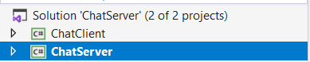
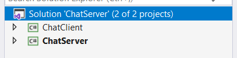
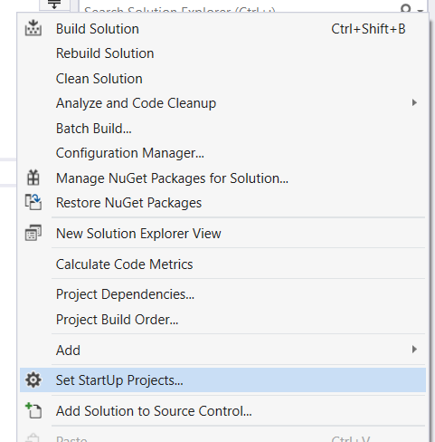
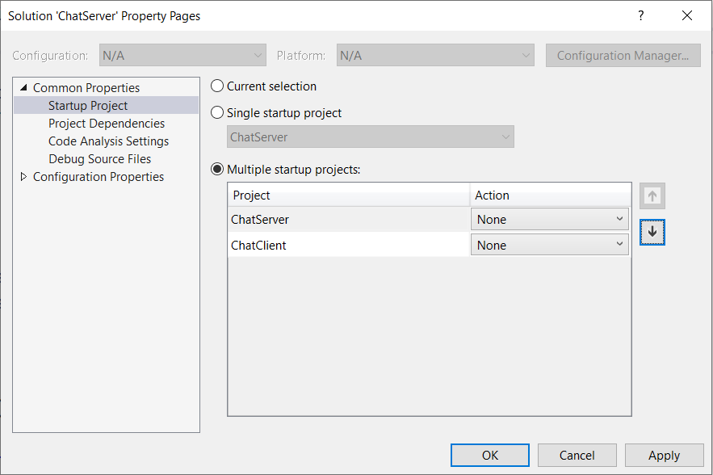
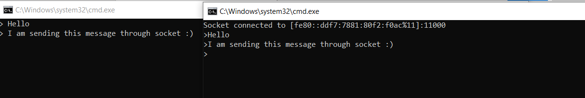
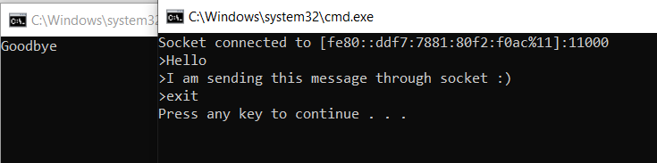

# Internet and Sockets

## 1. Какво ще направим?
Ще създадем конзолно приложение - чат, като изпратените съобщения чрез клиента ще получаваме съответно на сървъра, а комуникацията ще се осъществява посредством сокети.

## 2. Архитектура на проекта
Проектът, ще се състои от два подпроекта, като съответно единият ще служи за нашият socket сървър, а другият за socket клиент. Ще поставим и двата проекта под един solution на име ChatServer. 


 
За да се запази проекта в прост вид и да се наблегне върху новите знания за сокети, а не върху шаблони за дизайн, ще поставяме нашият код директно в Main() методите.

## 3. Сървър
Първо ще изградим имплементацията на нашия сървър. За такъв ще използваме конзолно приложение, което отваря нов socket, като се свързва на определен порт и започва да слуша за приидващи данни.

Приложението, което ще създадем ще работи само локално. Нека започнем с вземането на адрес данните за хоста ни. Ще използваме статичният клас Dns и в частност метода му GetHostName(), намиращ се в библиотеката System.Net, за да вземем името на текущия хост. След като разполагаме с името на хоста ще използваме метода GetHostEntry(), с параметър името на хоста, на същия клас, за да разглеждаме хоста като IPHostEntry – клас, който служи като контейнер за информация относно интернет хост адрес.

Тази информация ще използваме, за да вземем IPAddress-а на хоста (от списъка с адреси, който IPHostEntry-то съдържа).

IP адресът, който имаме, ще използваме за да създадем нова крайна точка (endpoint), към който трябва да се обърне клиента. Нека създадем нова иснтанция на класа System.Net.IPEndPoint, като за параметри ще подадем IP адреса и порта, към който искаме да се свържем. Нека изберем за порт 11000.

Какво имаме досега:
```
string hostname = Dns.GetHostName();
IPHostEntry ipHostInfo = Dns.GetHostEntry(hostname);
IPAddress ipAddress = ipHostInfo.AddressList[0];
IPEndPoint localEndPoint = new IPEndPoint(ipAddress, 11000);
```
След като сме създали нашия endpoint е време да създадем и сокет, който да слуша на този IP адрес. Ще създадем нова инстанция на класа Socket, който се намира в библиотеката System.Net.Sockets. За тип на сокета ще изберем Steam – това е типът, който поддържа надеждни, двустранни, базирани на връзка (connection-based) байтови потоци. Този тип сокети използват TCP.

Нека свържем сокета си към крайната ни точка, след което окажем на сокета да започне да слуша. Параметърът backlog, който получава метода Listen() е максималната дължина на опашката от висящи връзки. С масив от байтове ще създадем нашия буфер – размера на данни, който ще получаваме. Нека масивът ни е с размер 1024 байта. Върху вече създаденият ни сокет, който слуша за новоизискани връзки, ще създадем нов сокет, който приема първата заявка за свързване от вече споменатата опашка от висящи връзки.

С два вложени безкрайни цикъла ще проверяваме дали е пристигнало съобщение по нашия сокет. Ако това се е случило, ще го изпишем на екрана (конзолата). За край на съобщението ще приемаме **<EOF>**, което е съкращение стоящо за end of file. Текста получаван по сокета ще четем като ASCII енкодиран. Начинът, по който сокета ще поучава данните е чрез метода си Receive(), а като параметър се подава буфер – ние вече разполагаме с такъв.

Край на изпълнението на програма ще слага въвеждането на съобщение **exit**, за което ще проверяваме и при което ще прекъсваме действието цикъла си. Преди да направим това обаче е нужно да затворим сокета си, което става чрез методите Shutdown() – с параметър SocketShutDown.Both (затваря както за четене, така и за писане) и Close(). Преди да спрем изпълнението на сървъра ще изпишем на конзолата **Goodbye**.

Как изглежда това:
```
Socket listener = new Socket(ipAddress.AddressFamily, SocketType.Stream, ProtocolType.Tcp);
string message = "";
try
{
	byte[] buffer = new byte[1024];
	listener.Bind(localEndPoint);
	listener.Listen(100);
	Socket handle = listener.Accept();
	while (true)
	{
		message = "";
		while (true)
		{
			int messageSize = handle.Receive(buffer);
			message += Encoding.ASCII.GetString(buffer, 0, messageSize);
			if (message.Contains("<EOF>"))
			{
				message = message.Replace("<EOF>", "");
				break;
			}
		}
		Console.WriteLine("> " + message);
		if (message == "exit")
		{
			handle.Shutdown(SocketShutdown.Both);

			handle.Close();
			break;
		}
	}
}
catch (Exception ex)
{
	Console.WriteLine(ex.Message);
}
Console.Clear();
Console.WriteLine("Goodbye");
Console.ReadKey(true);
```
С това имплементацията на нашия сокет сървър е завършена.

## 4. Клиент
След като разполагаме със сокет сървър, е време да изградим и нашия сокет клиент. 

По аналогичен начин ще създадем сокет, но този път той ще служи за изпращане на данни.
```
IPHostEntry ipHostInfo = Dns.GetHostEntry(Dns.GetHostName());
IPAddress ipAddress = ipHostInfo.AddressList[0];
IPEndPoint remoteEP = new IPEndPoint(ipAddress, 11000);

Socket sender = new Socket(ipAddress.AddressFamily, SocketType.Stream, ProtocolType.Tcp);
``` 
В този случай ще използваме съответните методи на сокета за изпращане на данни. Съобщението ще четем от конзолата като потребителски вход, след което ще го преобразуваме в масив от байтове, като накрая на всяко съобщение ще долепваме **<EOF>**, за да окажем, че това е краят му (при натискане на enter).

Методът на сокета .Connect(), приемащ крайна точка осъществява връзката със сървъра ни, а методът Send(), приемащ масив от байтове изпраща съобщението към него. Отново ако съобщението е **exit** изпълнението на програмата приключва.

Как излежда това:
```
try
{
	sender.Connect(remoteEP);
	Console.WriteLine("Socket connected to {0}", sender.RemoteEndPoint.ToString());
	while (true)
	{
		Console.Write("> ");
		string message = Console.ReadLine();
		byte[] msg = Encoding.ASCII.GetBytes(message + "<EOF>");
		int bytesSent = sender.Send(msg);
		if (message == "exit") break;
	}
	sender.Shutdown(SocketShutdown.Both);
	sender.Close();
}
catch (Exception e)
{
	Console.WriteLine(e.Message);
}
```

## 5. Как да използваме приложението
За да използваме приложението, трябва сървърът да е пуснат преди клиента. В противен случай връзката не може да бъде осъществена. За целта ще се възползваме от инструментите на Visual Studio и ще настроим при старт на програта да се пускат едноврменно и сървърът и клиентът, като сървърът да е първи. 

 

От solution explorer-а ще изберем опцията Set StartUp Projects…, която можем да открием в падащото меню след десен клик върху името на solution-а ни.
 
 

От появилото се меню ще изберем опцията Multiple startup projects, и ще създадем последователността, в която проектите трябва да стартират – в нашия случай отгоре ще сложим сървърът. За Action съответно изберете start/start without debugging.

 

При стартиране на проекта би трябвало да се отворят две конзолни приложения – нашият сървър и нашият клиент. В клиентското приложение ще се изпише адреса, на който се е свързал сокета ни, както и съответния порт. На този етап всяко съобщение ще бъде изпратено от клиента на сървъра. Нека тестваме:

 
 
За да приключи изпълнението, както на нашия сървър, така и на нашия клиент въвеждаме като съобщение “exit”. Съответно преди да се затвори сървъра изчиства изпратените съобщения и изписва “Goodbye”.

  
	
Това е финалната стъпка – вече разполагаме със собствен чат сървър.