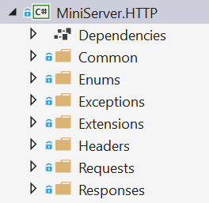

# HTTP Server
С помощта на този документ, вие ще създаде малък HTTP сървър, който изпраща и приема заявки. В последствие ще създадаем малък MVC Framework, който ще работи с нашият HTTP сървър.

## 1. Архитектура
Първо нека да създадем архитектурата на нашият проект. Създайте нов Solution и го кръстете MiniServer. Добавете два проекта към него:
- **MiniHTTP.HTTP**
- **MiniHTTP.WebServer**

## 2. MiniServer.HTTP Архитектура
HTTP проекта ще съдържа всички класове (и техните интерфейси), които ще бъда изпозлвани да имплементираме HTTP  комуникацията с TCP Link между клиента и нашият сървър. Можем да работим само с низове и байт масиви, но ще следваме добрите практики и ще го направим кода да бъде лесно четим и преизползваем.

Създайте следните папки в проекта **MiniServer.HTTP**



Както виждате архитектурата на папките е много добре разделена. Нека сега да започнем със създаването на класовете.

### Common папка
Common папката, ще съдържа класове, които се изпозлват в целият проект. Ще имаме два класа: GlobalConstants и CoreValidator.

#### GlobalConstants
Създайте статичен клас GlobalConstants, който ще бъде използван за споеделните константи:
```
public static class GlobalConstants
{
	public const string HttpOneProtocolFragment = "HTTP/1.1";
	public const string HostHeaderKey = "Host";
	public const string HttpNewLine = "\r\n";
}
``` 
Това са единствените константи, от които имаме нужда засега.

#### CoreValidator
Създайте клас CoreValidator, който ще има два метода, за проверка за null стойности или празни стрингове:
```
public class CoreValidator
{
	public static void ThrowIfNull(object obj, string name)
	{
		if (obj == null)
		{
			throw new ArgumentNullException(name);
		}
	}

	public static void ThrowIfNullOrEmpty(string text, string name)
	{
		if (string.IsNullOrEmpty(text))
		{
			throw new ArgumentException($"{name} cannot be null or empty.", name);
		}
	}
}
```
 
### Enums папка
Enums папката ще съдържа enumerations. Има два енъма, от които сървърът ще се нуждае: HttpRequestMethod и HttpResponseStatusCode.

#### HttpRequestMethod
Създайте Enum, с името HttpRequestMethod. Той ще дефинира, метода ,които сървъра получава
```
public enum HttpRequestMethod
{
	Get, Post, Put, Delete
}
```
Нашият сървър, ще поддържа само GET, POST, PUT и DELETE и заявки. Нямаме нужда от по-сложни заявки засега.

#### HttpResponseStatusCode
Създайте Enum, с името HttpResponseStatusCode. Той ще дефинира статус кода от отговора на нашият сървър. Този Enum, ще съдържа стойности, които са стутусите и цели числа, които ще представляват статус кода.
```
public enum HttpResponseStatusCode
{
	Ok = 200,
	Created = 201,
	Found = 302,
	SeeOther = 303,
	BadRequest = 400,
	Unauthorized = 401,
	Forbidden = 403,
	NotFound = 404,
	InternalServerError = 500
}
```
За сега нашият малък сървър, няма нужда да съдържа всички други статус кодове. Тези достатъчно сървъра и клиента да си комуникират.

### Exceptions папка
Exceptions папката ще съдържа класове, които отговорят за правилното менажиране на грешките в сървъра. За начало ще имаме класа, които ще отговарят за грешките: BadRequestException и InternalServerErrorException. Тези грешки, ще помагат, така, че сървъра винаги да връща отговор, дори в случай на Runtime Error.

Сървърът първо ще хваща грешки, които са от тип BadRequestException. Ако хване грешка от този тип, сървъра трябва да върне **400 Bad Request Response** и съобщение са грешката.

Всички други грешки ще бъдат от тип InternalServerErrorException или от базовия клас "Exception". Ако прихванем една от тези грешки, сървъра трябва да върне a **500 Internal Server Error**" и съобщение за грешката.

#### BadRequestException
Създайте клас, който се казва BadRequestException. Тази грешка ще бъде хвърлена, когато сървъра не успее да парсне HttpRequest, като Unsupported HTTP Protocol, Unsupported HTTP Method, Malformed Request и т.н. Класът трябва да наследява, Exception класа и трябва да има съобщение по подразбиране: **The Request was malformed or contains unsupported elements.**

#### InternalServerErrorException
Създайте клас, който се казва InternalServerErrorException. Тази грешка ще бъде хвърлена, когато не се е предполагало сървъра да се справи с нея. Класът трябва да наследява, Exception класа и трябва да има съобщение по подразбиране: **The Server has encountered an error.**

### Extensions папка
Extensions папката, ще съдържа extension методи, които ще ни помагат в разработката на нашият сървър. Ще има един клас StringExtensions.

#### StringExtensions
В този клас, имплементирайте низ extension метод, който се казва Capitalize(). Той трябва да направи първата буква главна и всички други малки.

### Headers папка
Headers папката, ще съдържа класове и интерфейси, които ще съхраняват данни за HTTP Headers на заявката и отговора.

#### HttpHeader
Създайте клас, който се казва HttpHeader. Той ще съхранява данните за HTTP Request/Response Header.
```
public HttpHeader(string key, string value)
{
	CoreValidator.ThrowIfNullOrEmpty(value, nameof(value));
	this.Key = key;
	this.Value = value;
}
public string Key { get; }
public string Value { get; }
public override string ToString()
{
	return $"{this.Key}: {this.Value}";
}
``` 
Пропъртито "Key", ще се използва за името на Header-a и пропъртито "Value", ще съдържа стойността. Имаме и в помощ "ToString()" метода, който ще връща добре форматиран и готов за използване Header.

#### IHttpHeaderCollection
Създайте интерфейс, който се казва IHttpHeaderCollection, който ще опише действията на "Repository-like object" за HttpHeaders.
```
public interface IHttpHeaderCollection
{
	void AddHeader(HttpHeader header);
	bool ContainsHeader(string key);
	HttpHeader GetHeader(string key);
}
``` 

#### HttpHeaderCollection
Създайте клас, който се казва HttpHeaderCollection, който имплементира IHttpHeaderCollection интерфейса. Този клас е като "Repository". Трябва да има Dictionary колекция на всички Headers и трябва да имплементирате всички методи на интерфейса.
```
class HttpHeaderCollection : IHttpHeaderCollection
{
	private readonly Dictionary<string, HttpHeader> headers;
	public HttpHeaderCollection()
	{
		this.headers = new Dictionary<string, HttpHeader>();
	}
	public void AddHeader(HttpHeader header) ...
	public bool ContainsHeader(string key) ...
	public HttpHeader GetHeader(string key) ...
	public override string ToString() ...
}
``` 
Имплементирайте всеки един от тези методи със следните функционалности:
- **AddHeader()** = Добавя Header-a. в речника с ключ – ключа на Header-a и стойност самият Header.
– **ContainsHeader()** = Главна причина да използва Dictionary. Позволява ни бързо търсене. Трябва върнем boolean, в зависимост от това дали колекцията съдържа даденият ключ.
- **GetHeader()** = Връща Header-a от колекцията с дадения ключ. Ако не съществува такъв Header, метода трябва да върне null.
- **ToString()** = Връща всички Headers, като низ, разделени с нов ред - ("/r/n") или Environment.NewLine

### Responses папка
Responses папката ще съдържа класове и интерфейси, които съдържат и манипулират информация за "HTTP Responses".

#### IHttpResponse
Създайте интерфейс, който се казва IHttpResponse и ще се съдържа следните пропъртита и методи:
```
public interface IHttpResponse
{
	HttpResponseStatusCode StatusCode { get; set; }
	IHttpHeaderCollection Headers { get; }
	byte[] Content { get; set; }
	void AddHeader(HttpHeader header);
	byte[] GetBytes();
}
```
 
#### HttpResponse
Създайте клас, който се казва HttpResponse и имплементира IHttpResponse интерфейса.
```
public class HttpResponse : IHttpResponse
{
	public HttpResponse()
	{
		this.Headers = new HttpHeaderCollection();
		this.Content = new byte[0];
	}
	public HttpResponse(HttpResponseStatusCode statusCode) : this()
	{
		CoreValidator.ThrowIfNull(statusCode, nameof(statusCode));
		this.StatusCode = statusCode;
	}
	public HttpResponseStatusCode StatusCode { get; set; }
	public IHttpHeaderCollection Headers { get; }
	public byte[] Content { get; set; }
	public void AddHeader(HttpHeader header) ...
	public byte[] GetBytes() ...
	public override string ToString() ...
}
``` 
Както виждате HttpResponse съдържа: StatusCode, Headers, Content и т.н. Това са единствените неща, от които ние се нуждаем за сега.  HttpResponse се инициализира с обект с Null ли по подразбиране стойности.

Сървърът получава Requests в текстов формат и трябва върне Responses в същият формат.

Репрезентацията на низа от HTTP Responses са в следният формат:
```
{protocol} {statusCode} {status}
{header1key}: {header1value}
{header2key}: {header2value}
...
<CRLF>
{content}
```
ЗАБЕЛЕЖКА: Както вече знаете, съдържанието (Response body) не е задължително.

Сега, докато изграждаме нашият HttpResponse обект, може да присвоим стойност за нашият StatusCode или може да го оставим за напред. Най-често ще присвояваме стойностите чрез конструктора.

#### AddHeader() метод
We can add Headers to it, gradually with the processing of the Request, using the AddHeader() method. Можем добавяме Headers, като използваме AddHeader() метода.
```
public void AddHeader(HttpHeader header)
{
	CoreValidator.ThrowIfNull(header, nameof(header));
	this.Headers.Add(header);
}
``` 
Другите пропъртита, StatusCode и Content могат да бъдат присвоени стойности от "външният свят", като използват публичните им сетъри.

Сега нека да видим ToString() и GetBytes() какво правят.

#### ToString() метод
ToString() метода формира Response реда – този ред съдържа протокола, статус кода, статус и Response Headers, като завършва с празен ред.  Тези пропъртита са съединени в един низ и върнати в края.
```
public override string ToString()
{
	StringBuilder result = new StringBuilder();
	result
	.Append($"{GlobalConstants.HttpOneProtocolFragment} {(int)this.StatusCode} {this.StatusCode.ToString()}")
	.Append(GlobalConstants.HttpNewLine)
	.Append(this.Headers)
	.Append(GlobalConstants.HttpNewLine)
	.Append(GlobalConstants.HttpNewLine);
	return result.ToString();
}
``` 
И точно сега се нуждаем от GetBytes() метода. 

#### GetBytes() метод
And with that we are finished with the HTTP work for now. We can proceed to the main functionality of the Server.

GetBytes() метода конвертира резултата от ToString() метода до byte[] масив, и долепя към него Content bytes, затова формираме целият Response до байт формат. Точна това, което трябва да изпратим до сървъра.

И вече приключихме с работата по нашият HTTP сървър за сега. 

### Requests папка
Сега е време да съберем всичко написано до момента в главните функциониращи класове.

Requests папката ще съдържа класове и интерфейси за съхранение и манипулиране данни за HTTP заявките.

#### IHttpRequest
Създайте интерфейс, който се казва IHttpRequest, който ще описва поведението на Request обекта. 
```
public interface IHttpRequest
{
	string Path { get; }
	string Url { get; }
	Dictionary<string, object> FormData { get; }
	Dictionary<string, object> QueryData { get; }
	IHttpHeaderCollection Headers { get; }
	HttpRequestMethod RequestMethod { get; }
}
```
 
#### HttpRequest
Създайте клас, който се казва HttpRequest, който имплементира IHttpRequest интерфейса. Класът трябва да имплементира и методите на интерфейса.
```
public class HttpRequest : IHttpRequest
{
	public HttpRequest(string requestString)
	{
		CoreValidator.ThrowIfNullOrEmpty(requestString, nameof(requestString));
		this.FormData = new Dictionary<string, object>();
		this.QueryData = new Dictionary<string, object>();
		this.Headers = new HttpHeaderCollection();
	}
	public string Path { get; private set; }
	public string Url { get; private set; }
	public Dictionary<string, object> FormData { get; }
	public Dictionary<string, object> QueryData { get; }
	public IHttpHeaderCollection Headers { get; }
	public HttpRequestMethod RequestMethod { get; private set; }
}
```
Както виждате HttpRequest, съдържа: Path, Url, RequestMethod, Headers, Data. Тези данни идвам променлива requestString, която се подава в констуктора. Това е начина, по които HttpRequest ще се инициализира. requestString ще изглежда по този начин:
```
{method} {url} {protocol}
{header1key}: {header1value}
{header2key}: {header2value}
...
<CRLF>
{bodyparameter1key}={bodyparameter1value}&{bodyparameter2key}={bodyparameter2value}...
```
ВНИМАНИЕ: Както вече знаете, че body parameters не за задължителни. Нека да разбием една нормална заявка и да видим как тя трябва да се мапне към нашите пропъртита.

Сега е време да имплементираме повече логика, което означава много методи, ако искаме да спазваме принципите за High-Quality Code. Имплементирайте следните методи.
```
private bool IsValidRequestLine(string[] requestLine)
private bool IsValidRequestQueryString(string queryString, string[] queryParameters)
private void ParseRequestMethod(string[] requestLine)
private void ParseRequestUrl(string[] requestLine)
private void ParseRequestPath()
private void ParseHeaders(string[] requestContent)
private void ParseCookies()
private void ParseQueryParameters()
private void ParseFormDataParameters(string formData)
private void ParseRequestParameters(string formData)
private void ParseRequest(string requestString)
```
**ParseRequest()** е метода откъдето започва всичко: 
```
public HttpRequest(string requestString)
{
	CoreValidator.ThrowIfNullOrEmpty(requestString, nameof(requestString));

	this.FormData = new Dictionary<string, object>();
	this.QueryData = new Dictionary<string, object>();
	this.Headers = new HttpHeaderCollection();

	this.ParseRequest(requestString);
}
```
Нека да видим как изглежда той:
```
private void ParseRequest(string requestString)
{
	string[] splitRequestContent = requestString.Split(new[] { GlobalConstants.HttpNewLine }, StringSplitOptions.None);
	
	string[] requestLine = splitRequestContent[0].Trim().Split(new[] { ' ' }, StringSplitOptions.RemoveEmptyEntries);

	if (!this.IsValidRequestLine(requestLine))
	{
		throw new BadRequestException();
	}

	this.ParseRequestMethod(requestLine);
	this.ParseRequestUrl(requestLine);
	this.ParseRequestPath();

	this.ParseHeaders(splitRequestContent.Skip(1).ToArray());
	this.ParseCookies();
	this.ParseRequestParameters(splitRequestContent[splitRequestContent.Length - 1]);
}
```
Както виждате requestString е разделен на нови редове в масив. Взимаме първият ред (The Request Line) и го разделяме. След това следват серия от проверки и присвояване не стойности към пропъртита.

Ще се наложи вие да имплементирате тези методи. Разбира се, ще ви бъдат дадени насоки, как да се справите с тях.

#### IsValidRequestLine() метод
Този метод проверя дали, разделеният requestLine съдържа точно 3 елемента и също така дали последният елемент е равен на "HTTP/1.1". Метода връща булев резултат.

#### IsValidRequestQueryString() метод
Този метод се използва в ParseQueryParameters() метода. Проверява дали Query низа е NOT NULL или празен и също така дали има поне един или много queryParameters.

#### ParseRequestMethod() метод
RequestMethod присвоя стойността, като преобразуваме първият елемент от разделеният requestLine.

#### ParseRequestUrl() метод
Url присвоява стойността от вторият елемент на разделеният requestLine.

#### ParseRequestPath() метод
Path присвоява стойността, като разделим Url и вземем само пътя от него.

#### ParseHeaders() метод
Пропускаме първият ред от requestLine и обхождаме всички останали редове, докато не стигнем празен ред. Всеки ред представлява header, който трябва да бъде разделен и преобразуван към правилният тип. След това информацията от низа е прехвърлена към HttpHeader обекта и е добавен към Headers пропертито на Request. Хвърлете BadRequestException, ако Host липсва след преобразуването.

#### ParseQueryParameters() метод
Извадете Query низа, като разделите "Request's Url" и вземете само query от него. След това разделете Query низа в различни параметри и го прехвърлете към "Query Data Dictionary". Валидирайте Query низа, като извикате IsValidrequestQueryString() метода. Ако в Request's Url липсва Query низа, не предприемайте действия. Хвърлете BadRequestException, ако Query не е валиден.

#### ParseFormDataParameters() метод
Разделете Request's Body  в различни параметри и го добавате към Form Data Dictionary. Не предприемайте действия, ако Request не съдържа тяло.

#### ParseRequestParameters() метод
Този метод извиква ParseQueryParameters() и  ParseFormDataParameters() методите. Това е просто wrapping метод. 

Ако сте имплементирали всички правилно, би трябвало да преобразувате дори и много сложни заявки без проблем.
