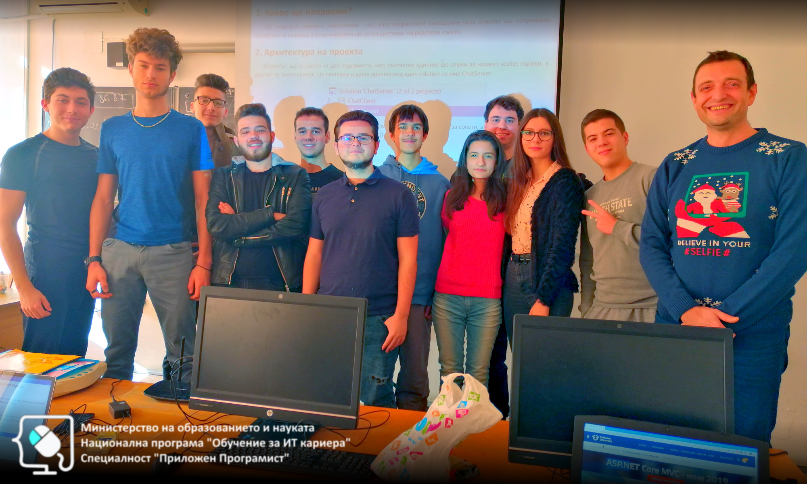

# Обучителен модул "Интернет програмиране"
- Национална програма "Обучение за ИТ кариера"
- Професия "Приложен програмист" 
- Образователен център: Професионална имназия по електротехника и електроника "Константин Фотинов", гр.Бургас  
- Електронен портал: https://it-kariera.mon.bg/e-learning/

## Преподавател
- доц. д-р Димитър Минчев
- e-mail: dimitar.minchev@gmail.com 
- blog: http://www.minchev.eu

## Учебна програма
01. Internet and Sockets 
02. HTTP
03. Introduction to HTML
04. HTTP Server
05. Introduction to MVC (part 1)
06. Introduction to MVC (part 2)
07. Database
08. Template Language
09. State Management
10. Authentication and Authorization
11. Security
12. REST API
13. Consuming REST API
14. Deployment

## Ресурси
- [C# Web Basics - май 2019](https://softuni.bg/trainings/2355/csharp-web-basics-may-2019)

- [ASP.NET Core MVC - юни 2019](https://softuni.bg/trainings/2419/asp-net-core-mvc-june-2019)

## Обучаеми 2020

