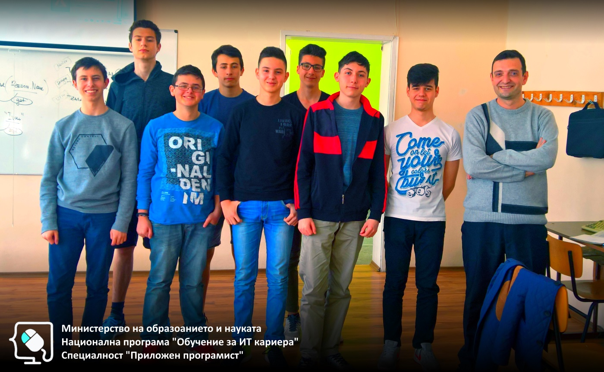

# Обучителен модул "Увод в обектно-ориентирано програмиране"
- Национална програма "Обучение за ИТ кариера"
- Професия "Приложен програмист" 
- Образователен център: Професионална имназия по електротехника и електроника "Константин Фотинов", гр.Бургас  
- Електронен портал: https://it-kariera.mon.bg/e-learning/

## Преподавател
- доц. д-р Димитър Минчев
- e-mail: dimitar.minchev@gmail.com 
- blog: http://www.minchev.eu

## Учебна програма
- [Дефиниране на класове](1.%20Classes)
- [Полета и методи](2.%20Properties%20and%20Methods)
- [Енкапсулация на данни](3.%20Encapsulation)
- [Статични полета и методи](4.%20Static%20Members)
- [Подготовка за практически изпит ](5.%20Exam%20Preparation)

## Обучаеми

## Видео уроци
1. [Откриване на курса](https://youtu.be/vPuIhPxp8og)
2. [Абстрактни типове данни и класове](https://youtu.be/2eCMk43DqNY)
3. [Дефиниране на класове](https://youtu.be/Ph7TTASkty0)
4. [Полета и свойства](https://youtu.be/rrXAYDTdask)
5. [Методи](https://youtu.be/nElQiU4_YGs)
6. [Конструктори](https://youtu.be/4VbLyEVsNiA)
7. [Допълнителни упражнения](https://youtu.be/8nOiga9ABpc)
8. [Капсулация - this](https://youtu.be/lU-eEWdo9CQ)
9. [Модификатори за достъп](https://youtu.be/-jm7ddKWA_c)
10. [Валидация](https://youtu.be/F5iYqWs3sPQ)
11. [Допълнителни упражнения](https://youtu.be/S6wkay2Vlp8)
12. [Статични полета и свойства](https://youtu.be/ZMol3jI-M9w)
13. [Статични методи](https://youtu.be/hE0qOfrR5kY)
14. [Допълнителни упражнения](https://youtu.be/-lGh4kRvVE4)
15. [Допълнителни упражнения](https://youtu.be/7Tdh2jRXFw4)
16. [Решаване на изпитни задачи](https://youtu.be/VXS1FFIhQxM)
17. [Решаване на изпитни задачи](https://youtu.be/fe_dWWjaz0c)
