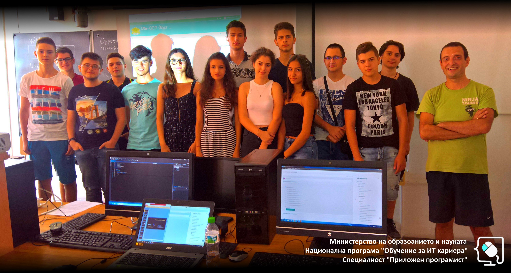

# Обучителен модул "Обектно-ориентирано програмиране"
- Национална програма "Обучение за ИТ кариера"
- Професия "Приложен програмист" 
- Образователен център: Професионална имназия по електротехника и електроника "Константин Фотинов", гр.Бургас  
- Електронен портал: https://it-kariera.mon.bg/e-learning/

## Преподавател
- доц. д-р Димитър Минчев
- e-mail: dimitar.minchev@gmail.com 
- blog: http://www.minchev.eu

## Учебна програма
- Компонентно тестване
- Дефиниране на класове за напреднали
- Шаблонни класове
- Наследяване, абстракция, интерфейси	
- Полиморфизъм в ООП
- Работа с обекти
- Елементи от функционалното програмиране
- Комуникация между обекти (събития / интерфейси)
- Изключения (exceptions)	
- Работа с потоци и файлове
- Базови шаблони за дизайн (design patterns)	
- Подготовка за практически изпит 

## Обучаеми

## Видео уроци
1. [Откриване на курса](https://youtu.be/Vd5nml7ZthQ)
2. [Компонентно тестване](https://youtu.be/DxHbpT6u0V4)
3. [Компонентно тестване](https://youtu.be/5CwkbtVGlEI)
4. [Дефиниране на класове за напреднали](https://youtu.be/pTymyS0ry8E)
5. [Дефиниране на класове за напреднали](https://youtu.be/WvHgA7YvK34)
6. [Дефиниране на класове за напреднали](https://youtu.be/QfWWXrTLAgA)
7. [Шаблонни класове](https://youtu.be/TF1thhcmeRc)
