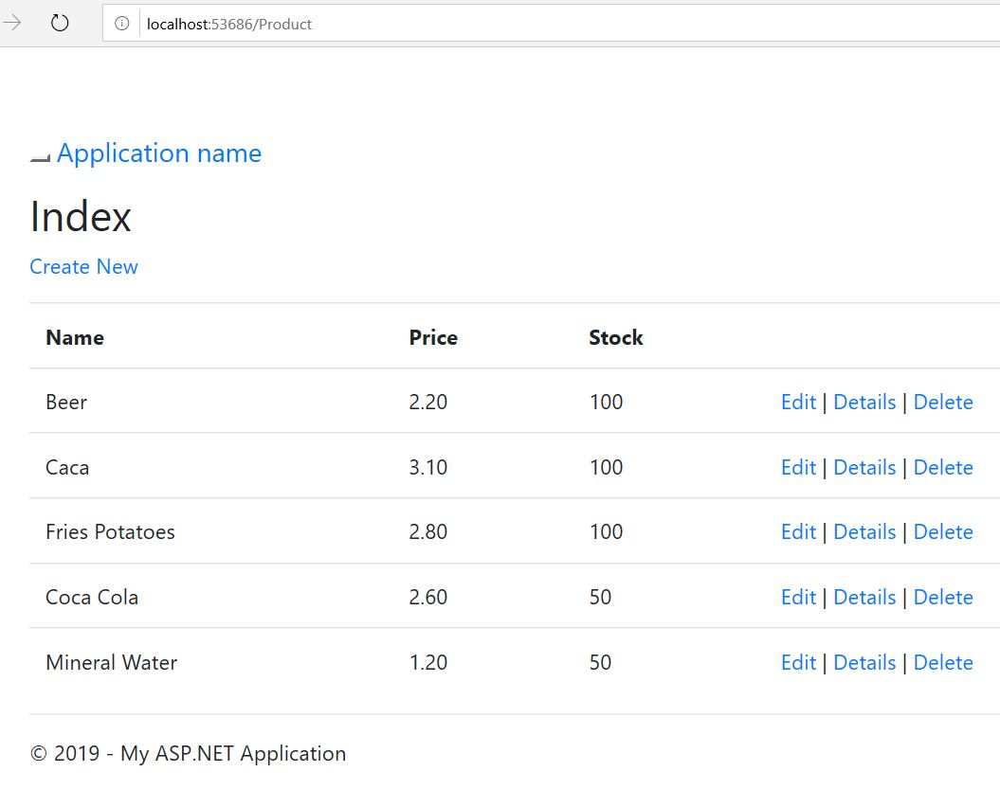

# Проекти

MySQL Sample Product Database
```
/* Промерна продуктова база данни */
DROP DATABASE IF EXISTS products;
CREATE DATABASE IF NOT EXISTS products;
USE products;
CREATE TABLE IF NOT EXISTS products (

    `id` INT(10) AUTO_INCREMENT,
    `name` VARCHAR(255) NOT NULL,
    `price` DECIMAL(4,2) NOT NULL,
    `stock` INT(5) NOT NULL,
    PRIMARY KEY (id)
);
INSERT INTO products (`name`,`price`,`stock`) VALUES 
("Beer",2.20,100),
("Caca",3.10,100),
("Fries Potatoes",2.80,100),
("Coca Cola",2.60,50),
("Mineral Water",1.20,50);
```

## 1. Windows Forms


## 2. ASP.NET


## 3. Universal Windows Platform
