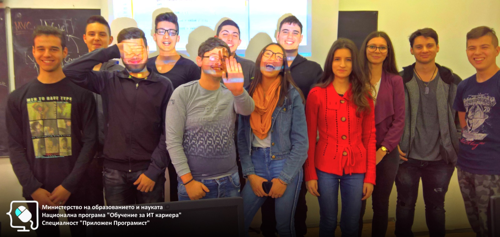

# Обучителен модул "Разработка на софтуер"
- Национална програма "Обучение за ИТ кариера"
- Професия "Приложен програмист" 
- Образователен център: Професионална имназия по електротехника и електроника "Константин Фотинов", гр.Бургас  
- Електронен портал: https://it-kariera.mon.bg/e-learning/

## Преподавател
- доц. д-р Димитър Минчев
- e-mail: dimitar.minchev@gmail.com 
- blog: http://www.minchev.eu

## Учебна програма
1. Увод в разработката на софтуер. Преглед на трислойния модел
2. Увод в концепцията за тестване. Писане на unit тестове
3. Увод в концепцията за дебъгване. Откриване и отстраняване на проблеми
4. Преработка и постепенни промени
5. Инструменти за разработка
6. Пакети и външни библиотеки
7. Свързване на приложения с бази от данни
8. Създаване на приложения с няколко потребителски интерфейса

## Обучаеми

